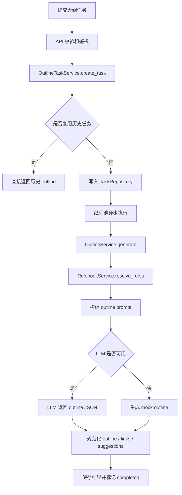

# 项目整体流程图

基于当前项目代码整理，核心链路可分为「整体请求流」和「文章生成流」两部分。

## 1. 项目整体流程

```mermaid
flowchart TD
    A[用户或 Demo 页面] --> B[认证: access key 换 bearer token]
    B --> C[FastAPI API 路由]

    C --> D{请求类型}
    D -->|生成大纲| E[/POST /api/outline/]
    D -->|生成文章| F[/POST /api/tasks/]
    D -->|查询结果| G[/GET /api/outline/{id} 或 /api/tasks/{id}/]
    D -->|导出文档| H[/GET /api/tasks/{id}/export.docx/]

    E --> I[OutlineTaskService]
    F --> J[TaskService]

    I --> K[TaskRepository]
    J --> K

    I --> L[OutlineService]
    J --> M[WriterService]

    L --> N[RulebookService]
    L --> O[LLMClient]

    M --> N
    M --> O
    M --> P[ArticleValidator]
    M --> Q[ImageService]
    Q --> R[Aliyun OSS]

    J --> S[CacheService]
    H --> T[DocExportService]

    K --> U[(MySQL 或 Memory Repository)]
    S --> V[(本地 Cache 文件)]
```

## 2. 文章生成详细流程

```mermaid
flowchart TD
    A[提交文章任务<br/>category keyword info task_context] --> B[API 参数校验]
    B --> C[TaskService.create_task]
    C --> D{是否 force_refresh}

    D -->|否| E[查找可复用任务]
    D -->|是| F[创建新任务]
    E --> G{是否命中已完成任务}
    G -->|是| H[直接返回历史任务结果]
    G -->|否| F

    F --> I[写入 TaskRepository<br/>status = queued]
    I --> J[线程池异步执行 _run_task]
    J --> K[更新状态为 running]
    K --> L{是否命中文章缓存}

    L -->|是| M[读取缓存文章]
    M --> N{是否还需要封面图或正文图}
    N -->|是| O[ensure_images 补图]
    N -->|否| P[保存结果]
    O --> P

    L -->|否| Q[WriterService.generate]
    Q --> R[标准化 task_context]
    R --> S[RulebookService.resolve_rules]
    S --> T{LLM 是否可用}

    T -->|是| U[生成策略 Prompt]
    U --> V[LLM 生成 strategy JSON]
    V --> W[规范化 SEO 或 GEO strategy]
    W --> X[生成 draft Prompt]
    X --> Y[LLM 生成 draft HTML]
    Y --> Z[生成 polish Prompt]
    Z --> AA[LLM 润色 polished HTML]
    AA --> AB[打包 article 对象]

    T -->|否| AC[生成 mock article]
    AC --> AD[ArticleValidator 校验和修正]
    AB --> AD

    AD --> AE[ImageService 生成或注入图片]
    AE --> AF[写入 CacheService]
    AF --> P

    P --> AG[TaskRepository.save_result]
    AG --> AH[更新状态为 completed]
    AH --> AI[GET /api/tasks/{id} 查询结果]
    AI --> AJ[WriterService.present_article]
    AJ --> AK[返回 html raw_html images cover_image content_images]
```

## 3. 大纲生成流程



